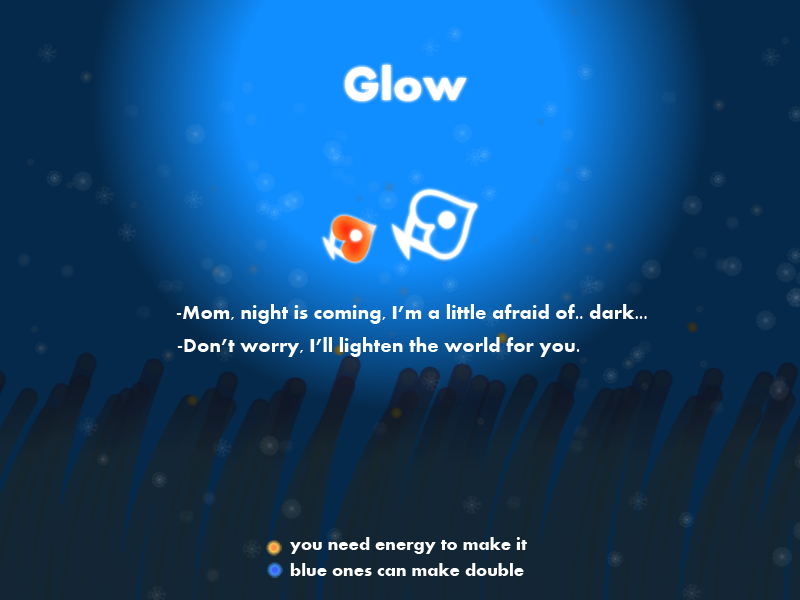

# LoveFish
## 1 文档规范
1、待做标注为`//TODO`  
2、已做标注为`//DONE`
## 2 前言
H5添加了很多新鲜、有趣的标签，不仅为前端提供了多样化的功能，还给了开发者在设计产品时更大的自由度。  
LoveFish是一款HTML5游戏，是我对画布作图对象 -- CanvasRenderingContext2D中的一个实践。毕竟，当时H5游戏很火。 
## 3 使用
-> 下载本项目 
-> 在浏览器中打开'page/loveFish.html'即可 
-> 项目界面如下图： 

## 4 技术选型
HTML5 + CSS + javascript + fis3 + Require.js 
### 4.1 requirejs
LoveFish的HTML和CSS结构十分简单，但Javascript较为复杂。 
由于程序逻辑性较强、JS文件间依赖关系复杂，我选用了模块加载器 -- [Require.js](http://www.requirejs.cn/)去进行模块管理，便于开发。 
### 4.2 FIS3
为了优化性能，我采用了百度开发的前端构建工具[FIS3](http://fis.baidu.com/)去进行文件、图片的压缩。 
总的说来，FIS3这款前端构建工具可圈可点。其'资源定位'特性我认为是其亮点，而且用FIS3进行文件或图片的压缩、文件打包合并、解析预处理语言、cssSprite都极为方便，但FIS3后续推出的高级功能 -- 模块化开发这块我就觉得有点不太实在了。 
FIS3所提出的模块化开发思路是把各模块文件用postpackager-loader插件(一个FIS3打包插件)打包到一个新创建的文件中，但这样只能说FIS3在项目开发过程中做到了'模块化'。而且，这部分的官方文档写的很乱、用词不清，给人一种FIS3团队自己都没搞明白的感觉。 
## 5 不足
####5.1 游戏性
1、大鱼喂食小鱼模块有逻辑上的Bug。大鱼无论是吃一颗果实还是吃N颗果实，喂食小鱼后小鱼都会恢复至满血状态。`//TODO` 
2、大鱼在吃果实时可以添加动作，更显生动。`//TODO` 
3、可以尝试添加有毒的果实、躲避凶猛的大型鱼类等多种关卡。`//TODO` 
####5.2 游戏性能
游戏中的每一事物我都将其作为对象去构造的，但我所采用的面向对象编程的模式还比较基础，需继续学习、多看源码，持续优化。`//TODO` 
